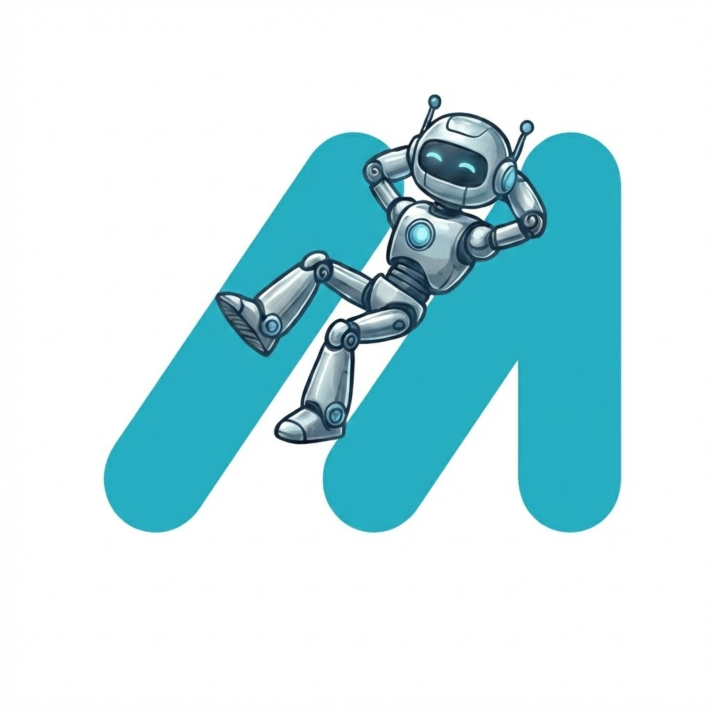
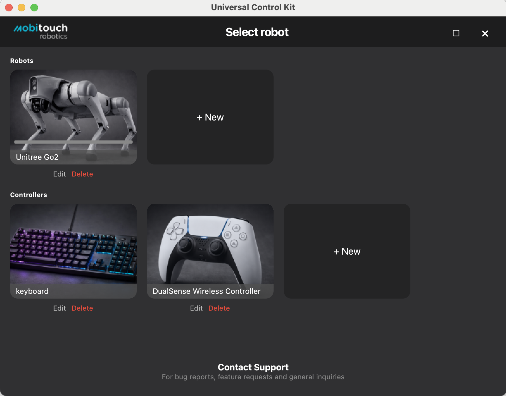

<p align="center">
  
</p>

<h1 align="center">Universal Control Kit</h1>

<p align="center">
  A modular, cross-platform app for controlling robots with keyboard or gamepad.
</p>

<p align="center">
  Built with Python · PyQt5 · WebRTC · asyncio
</p>

<p align="center">
  
</p>

## Features

- **Gamepad & Keyboard Control** — universal input handling with customizable mappings
- **Real-time Camera Feed** — live video stream from your robot via WebRTC
- **Robot Actions** — walk, run, sit, stretch, dance, jump, wave, Sport Mode, and more
- **Flashlight & LED Control** — adjust brightness and cycle LED colors
- **Lidar Integration** — enable/disable lidar scanner and receive point cloud data
- **Extensible Architecture** — add new robot types or UI backends via protocol-based design
- **Cross-platform** — runs on macOS, Windows, and Linux
- **Internationalization** — ready for translation with gettext

## Supported Robots

| Robot | Connection Modes | Status |
|-------|-----------------|--------|
| **Unitree Go2** | Local AP, Local STA, Remote | Supported |

Want to add your robot? See [Contributing](#contributing).

## Installation

Pre-built packages for macOS and Windows are available on the [Releases](https://github.com/mobitouch-robotics/UniversalControlKit/releases) page.

### Connect your robot

The app supports three connection modes:
- **Local AP** — connect directly to the robot's Wi-Fi hotspot
- **Local STA** — robot and computer on the same local network
- **Remote** — cloud-based connection using serial number and credentials

### Add a controller

Use the app to add a keyboard or gamepad controller with customizable button mappings. DualSense, ROG Ally, and other gamepads are supported out of the box.

## Building from Source

```bash
git clone https://github.com/mobitouch-robotics/UniversalControlKit.git
```

Open the project in VS Code and use the provided launch configuration to run the app. The environment setup (Python venv, dependencies) is handled automatically on first launch.

## Architecture

The project uses a protocol-based architecture that makes it easy to extend:

```
Robot (ABC)              MovementController (ABC)
  └── RobotGo2              ├── KeyboardController
  └── YourRobot?            └── GamepadController
```

- **`src/robot/robot.py`** — abstract base class for all robot implementations
- **`src/ui/protocols.py`** — UI and input controller abstractions
- **`src/robot/robot_go2.py`** — Unitree Go2 implementation (WebRTC + async)
- **`src/ui/qt/`** — PyQt5 UI components

## Project Goals

- Provide a user-friendly, hackable interface for controlling robots with keyboard or gamepad
- Make it easy to add new robot types through a simple protocol-based architecture
- Enable research, education, and rapid prototyping with real robots
- Support new robot models and platforms as SDKs evolve

## Contributing

Contributions are welcome! Whether it's bug reports, feature requests, new robot support, UI improvements, or documentation — feel free to [open an issue](https://github.com/mobitouch-robotics/UniversalControlKit/issues) or submit a pull request.

### Adding a new robot

Subclass `Robot` in `src/robot/robot.py`, implement the abstract methods (`connect`, `disconnect`, `move`, `get_camera_frame`, etc.), and register it in `robot_repository.py`. The UI will pick it up automatically.

## License

MIT License — see [LICENSE](LICENSE) for details.

## Acknowledgements

- [unitree_webrtc_connect](https://github.com/legion1581/unitree_webrtc_connect) for WebRTC integration
